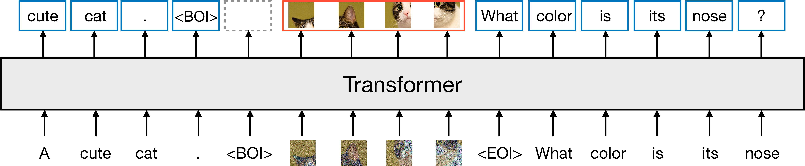
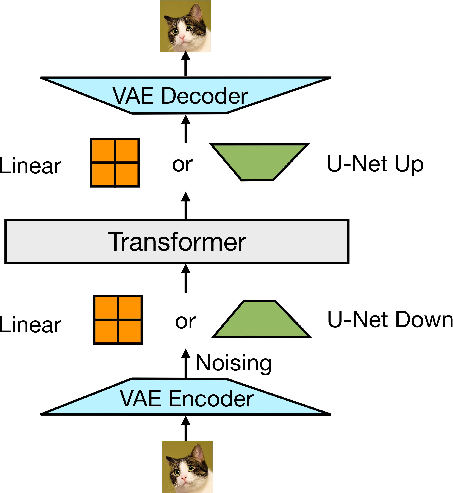
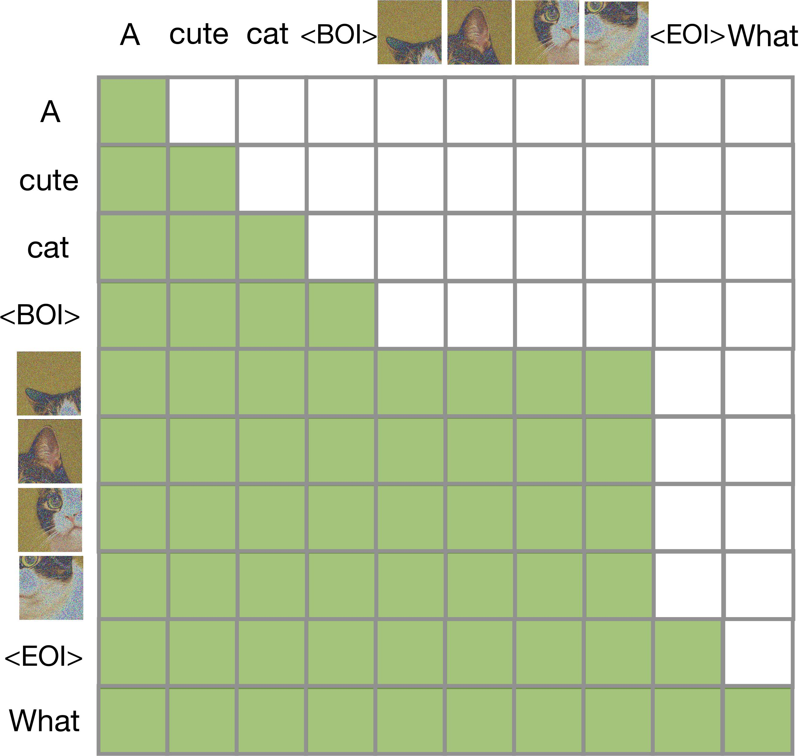

# 💉🩸 Transfusion: Predict the Next Token and Diffuse Images with One Multi-Modal Model

<div align="center">

[](https://arxiv.org/abs/2408.11039)&nbsp;

</div>

## Claims

⚠️ This is an **unofficial implementation** of Transfusion.

There are many great repositories about Transfusion on Github, including [transfusion-pytorch](https://github.com/lucidrains/transfusion-pytorch) and [Transfusion.torch](https://github.com/VachanVY/Transfusion.torch). This repository follows the overall architecture of [LLaVA](https://github.com/haotian-liu/LLaVA) and adopts LLaMA2 / Vicuna as the backbone Transformer, enabling Transfusion to inherit strong text modeling capabilities. Since the original paper does not specify the implementation details of the linear layers, we adopt the patch embedding and final layer from [DiT](https://github.com/facebookresearch/DiT) to incorporate diffusion timesteps into the model.

## Introduction

### Abstract

> We introduce Transfusion, a recipe for training a multi-modal model over discrete and continuous data. Transfusion combines the language modeling loss function (next token prediction) with diffusion to train a single transformer over mixed-modality sequences. We pretrain multiple Transfusion models up to 7B parameters from scratch on a mixture of text and image data, establishing scaling laws with respect to a variety of uni- and cross-modal benchmarks. Our experiments show that Transfusion scales significantly better than quantizing images and training a language model over discrete image tokens. By introducing modality-specific encoding and decoding layers, we can further improve the performance of Transfusion models, and even compress each image to just 16 patches. We further demonstrate that scaling our Transfusion recipe to 7B parameters and 2T multi-modal tokens produces a model that can generate images and text on a par with similar scale diffusion models and language models, reaping the benefits of both worlds.

### Overview

A high-level illustration of Transfusion. A single transformer perceives, processes, and produces data of every modality. Discrete (text) tokens are processed autoregressively and trained on the next token prediction objective. Continuous (image) vectors are processed together in parallel and trained on the diffusion objective. Marker BOI and EOI tokens separate the modalities.



We convert images to and from latent representations using a pretrained VAE, and then into patch representations with either a simple linear layer or U-Net down blocks.

Expanding on the causal mask, Transfusion allows patches of the same image to condition on each other.

<div align="center">
  
  
</div>

## TODO

### Training

* [x] Train a continuous VAE
* [ ] Train an understanding model
* [ ] Train a generation model

### Model Architecture

* [x] Support LLaMA2 / Vicuna
* [x] Transfusion Attention
* [ ] U-Net blocks
* [ ] Noise limit
* [ ] Support Qwen2
* [ ] Support flow matching

## Contents
- [Install](#install)
- [Train](#train)

## Install

```Shell
conda create -n transfusion python=3.10 -y
conda activate transfusion
pip install -e .
```

## Train

### Data

Please download the annotation of the final mixture our instruction tuning data [llava_v1_5_mix665k.json](https://huggingface.co/datasets/liuhaotian/LLaVA-Instruct-150K/blob/main/llava_v1_5_mix665k.json), and download the images from constituting datasets:

- COCO: [train2017](http://images.cocodataset.org/zips/train2017.zip)
- GQA: [images](https://downloads.cs.stanford.edu/nlp/data/gqa/images.zip)
- OCR-VQA: [download script](https://drive.google.com/drive/folders/1_GYPY5UkUy7HIcR0zq3ZCFgeZN7BAfm_?usp=sharing), **we save all files as `.jpg`**
- TextVQA: [train_val_images](https://dl.fbaipublicfiles.com/textvqa/images/train_val_images.zip)
- VisualGenome: [part1](https://cs.stanford.edu/people/rak248/VG_100K_2/images.zip), [part2](https://cs.stanford.edu/people/rak248/VG_100K_2/images2.zip)

After downloading all of them, organize the data as follows in `./data`,

```
├── coco
│   └── train2017
├── gqa
│   └── images
├── ocr_vqa
│   └── images
├── textvqa
│   └── train_images
└── vg
    ├── VG_100K
    └── VG_100K_2
```

### Understanding

```bash
bash scripts/train_lora.sh
```

[LLaVA/issues/1231](https://github.com/haotian-liu/LLaVA/issues/1231)

## Evaluation

| Model | LLM | Vision Encoder | Image Size | VQAv2 | GQA | VisWiz | SciQA-IMG | TextVQA | POPE | MME | MMBench | SEED-Bench | LLaVA-Wild | MMVet |
|-------|-----|----------------|------------|-------|-----|--------|-----------|---------|------|-----|---------|------------|------------|-------|
| LLaVA-1.5-7B | Vicuna-7B-v1.5 | CLIP-ViT-L-336px | 336² | 78.5 | 62.0 | 50.0 | 66.8 | 58.2 | 85.9 | 1510.7 | 64.3 | 58.6 | 65.4 | 31.1 |
| Transfusion-7B | Vicuna-7B-v1.5 | Transfusion-VAE | 256² | - | - | - | - | - | - | - | - | - | - | - |

### VQAv2

1. Download [`test2015`](http://images.cocodataset.org/zips/test2015.zip) and put it under `./playground/data/eval/vqav2`.
2. Multi-GPU inference.
```Shell
CUDA_VISIBLE_DEVICES=0,1,2,3,4,5,6,7 bash scripts/v1_5/eval/vqav2.sh
```
3. Submit the results to the [evaluation server](https://eval.ai/web/challenges/challenge-page/830/my-submission): `./playground/data/eval/vqav2/answers_upload`.

### GQA

1. Download the [data](https://cs.stanford.edu/people/dorarad/gqa/download.html) and [evaluation scripts](https://cs.stanford.edu/people/dorarad/gqa/evaluate.html) following the official instructions and put under `./playground/data/eval/gqa/data`. You may need to modify `eval.py` as [this](https://gist.github.com/haotian-liu/db6eddc2a984b4cbcc8a7f26fd523187) due to the missing assets in the GQA v1.2 release.
2. Multi-GPU inference.
```Shell
CUDA_VISIBLE_DEVICES=0,1,2,3,4,5,6,7 bash scripts/v1_5/eval/gqa.sh
```

### VisWiz

1. Download [`test.json`](https://vizwiz.cs.colorado.edu/VizWiz_final/vqa_data/Annotations.zip) and extract [`test.zip`](https://vizwiz.cs.colorado.edu/VizWiz_final/images/test.zip) to `test`. Put them under `./playground/data/eval/vizwiz`.
2. Single-GPU inference.
```Shell
CUDA_VISIBLE_DEVICES=0 bash scripts/v1_5/eval/vizwiz.sh
```
3. Submit the results to the [evaluation server](https://eval.ai/web/challenges/challenge-page/2185/my-submission): `./playground/data/eval/vizwiz/answers_upload`.

### ScienceQA

1. Under `./playground/data/eval/scienceqa`, download `images`, `pid_splits.json`, `problems.json` from the `data/scienceqa` folder of the ScienceQA [repo](https://github.com/lupantech/ScienceQA).
2. Single-GPU inference and evaluate.
```Shell
CUDA_VISIBLE_DEVICES=0 bash scripts/v1_5/eval/sqa.sh
```

### TextVQA

1. Download [`TextVQA_0.5.1_val.json`](https://dl.fbaipublicfiles.com/textvqa/data/TextVQA_0.5.1_val.json) and [images](https://dl.fbaipublicfiles.com/textvqa/images/train_val_images.zip) and extract to `./playground/data/eval/textvqa`.
2. Single-GPU inference and evaluate.
```Shell
CUDA_VISIBLE_DEVICES=0 bash scripts/v1_5/eval/textvqa.sh
```

### POPE

1. Download `coco` from [POPE](https://github.com/AoiDragon/POPE/tree/e3e39262c85a6a83f26cf5094022a782cb0df58d/output/coco) and put under `./playground/data/eval/pope`.
2. Single-GPU inference and evaluate.
```Shell
CUDA_VISIBLE_DEVICES=0 bash scripts/v1_5/eval/pope.sh
```

### MME

1. Download the data following the official instructions [here](https://github.com/BradyFU/Awesome-Multimodal-Large-Language-Models/tree/Evaluation).
2. Downloaded images to `MME_Benchmark_release_version`.
3. put the official `eval_tool` and `MME_Benchmark_release_version` under `./playground/data/eval/MME`.
4. Single-GPU inference and evaluate.
```Shell
CUDA_VISIBLE_DEVICES=0 bash scripts/v1_5/eval/mme.sh
```

### MMBench

1. Download [`mmbench_dev_20230712.tsv`](https://download.openmmlab.com/mmclassification/datasets/mmbench/mmbench_dev_20230712.tsv) and put under `./playground/data/eval/mmbench`.
2. Single-GPU inference.
```Shell
CUDA_VISIBLE_DEVICES=0 bash scripts/v1_5/eval/mmbench.sh
```
3. Submit the results to the [evaluation server](https://opencompass.org.cn/leaderboard-multimodal): `./playground/data/eval/mmbench/answers_upload/mmbench_dev_20230712`.

### MMBench-CN

1. Download [`mmbench_dev_cn_20231003.tsv`](https://download.openmmlab.com/mmclassification/datasets/mmbench/mmbench_dev_cn_20231003.tsv) and put under `./playground/data/eval/mmbench`.
2. Single-GPU inference.
```Shell
CUDA_VISIBLE_DEVICES=0 bash scripts/v1_5/eval/mmbench_cn.sh
```
3. Submit the results to the evaluation server: `./playground/data/eval/mmbench/answers_upload/mmbench_dev_cn_20231003`.


### SEED-Bench

1. Following the official [instructions](https://github.com/AILab-CVC/SEED-Bench/blob/main/DATASET.md) to download the images and the videos. Put images under `./playground/data/eval/seed_bench/SEED-Bench-image`.
2. Extract the video frame in the middle from the downloaded videos, and put them under `./playground/data/eval/seed_bench/SEED-Bench-video-image`. We provide our script `extract_video_frames.py` modified from the official one.
3. Multiple-GPU inference and evaluate.
```Shell
CUDA_VISIBLE_DEVICES=0,1,2,3,4,5,6,7 bash scripts/v1_5/eval/seed.sh
```
4. Optionally, submit the results to the leaderboard: `./playground/data/eval/seed_bench/answers_upload` using the official jupyter notebook.

### LLaVA-Bench-in-the-Wild

1. Extract contents of [`llava-bench-in-the-wild`](https://huggingface.co/datasets/liuhaotian/llava-bench-in-the-wild) to `./playground/data/eval/llava-bench-in-the-wild`.
2. Single-GPU inference and evaluate.
```Shell
CUDA_VISIBLE_DEVICES=0 bash scripts/v1_5/eval/llavabench.sh
```

### MM-Vet

1. Extract [`mm-vet.zip`](https://github.com/yuweihao/MM-Vet/releases/download/v1/mm-vet.zip) to `./playground/data/eval/mmvet`.
2. Single-GPU inference.
```Shell
CUDA_VISIBLE_DEVICES=0 bash scripts/v1_5/eval/mmvet.sh
```
3. Evaluate the predictions in `./playground/data/eval/mmvet/results` using the official jupyter notebook.

## Acknowledgements

- [Transfusion](https://arxiv.org/abs/2408.11039)
- [transfusion-pytorch](https://github.com/lucidrains/transfusion-pytorch)
- [Transfusion.torch](https://github.com/VachanVY/Transfusion.torch)
- [LLaVA](https://github.com/haotian-liu/LLaVA)
- [DiT](https://github.com/facebookresearch/DiT)
- [BLIP3o](https://github.com/JiuhaiChen/BLIP3o/tree/main)
- [MetaMorph](https://github.com/facebookresearch/metamorph)
- [OmniGen](https://github.com/VectorSpaceLab/OmniGen)
- [Show-o](https://github.com/showlab/Show-o)
- [Janus](https://github.com/deepseek-ai/Janus)

## Citations

```
@article{zhou2024transfusion,
  title={Transfusion: Predict the next token and diffuse images with one multi-modal model},
  author={Zhou, Chunting and Yu, Lili and Babu, Arun and Tirumala, Kushal and Yasunaga, Michihiro and Shamis, Leonid and Kahn, Jacob and Ma, Xuezhe and Zettlemoyer, Luke and Levy, Omer},
  journal={arXiv preprint arXiv:2408.11039},
  year={2024}
}
```
